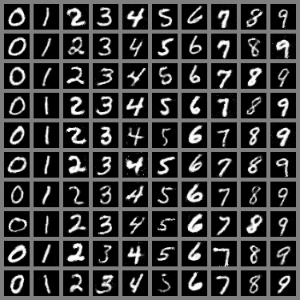

# CGAN_jittor
## 简介
使用Jittor框架实现的简单cGAN网络，使用MNIST数据集，将随机噪声和类别标签映射为数字图片，训练后可以生成指定的数字图像

## 环境部署
- Win10 操作系统
- python = 3.10.14
- jittor = 1.3.8.5
如果使用Anaconda，可以通过如下指令安装：
`python -m pip install jittor`

## 项目运行

```bash
python CGAN.py 
```
## 模型结果





